### 前言

---

一刻记账的开源版本终于来啦. 开源版本和商用版本最大的区别就是去掉了服务器相关的支持

所有和服务器相关的功能在开源版本是没有的. 但是开源版本默认会为您完成登录. 使用默认 userId

所有记账功能基本都是 ok 的. 有兴趣的点点 star 哦

### 产品示例图

---

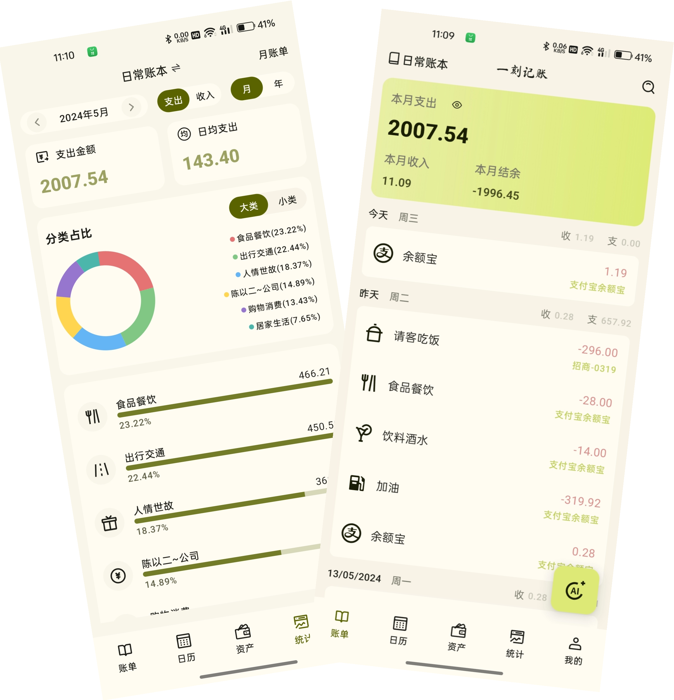

---

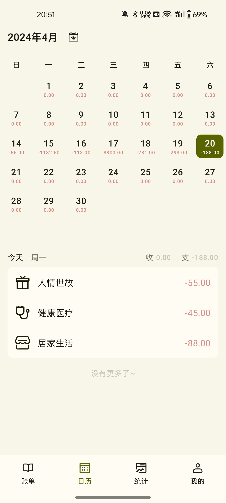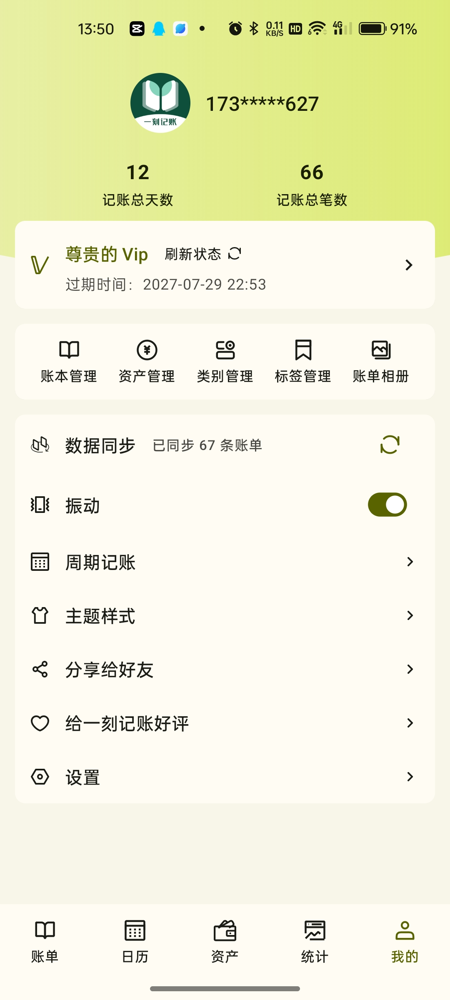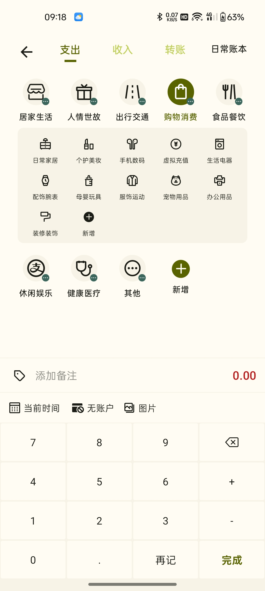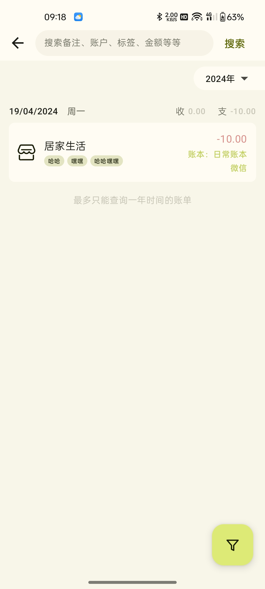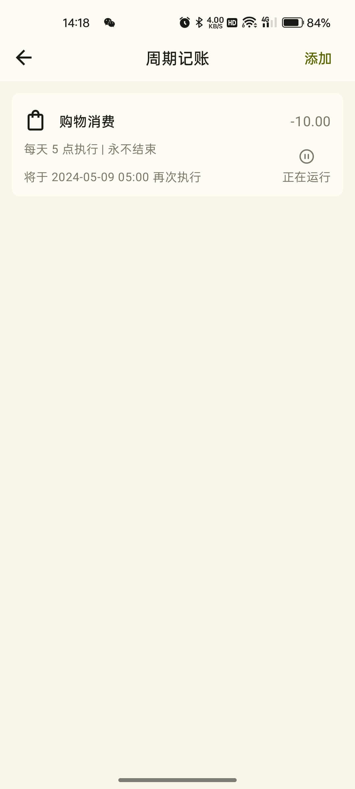

---

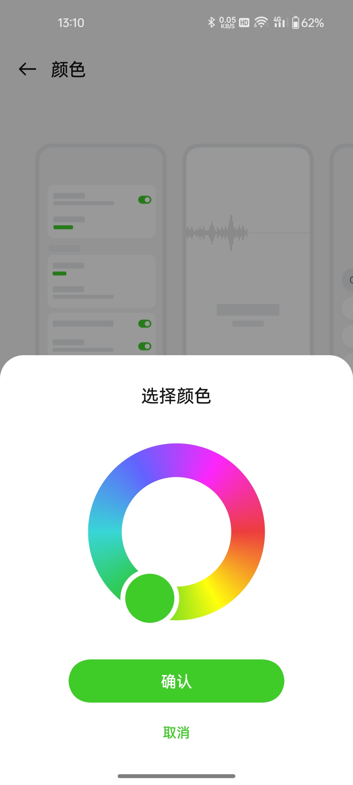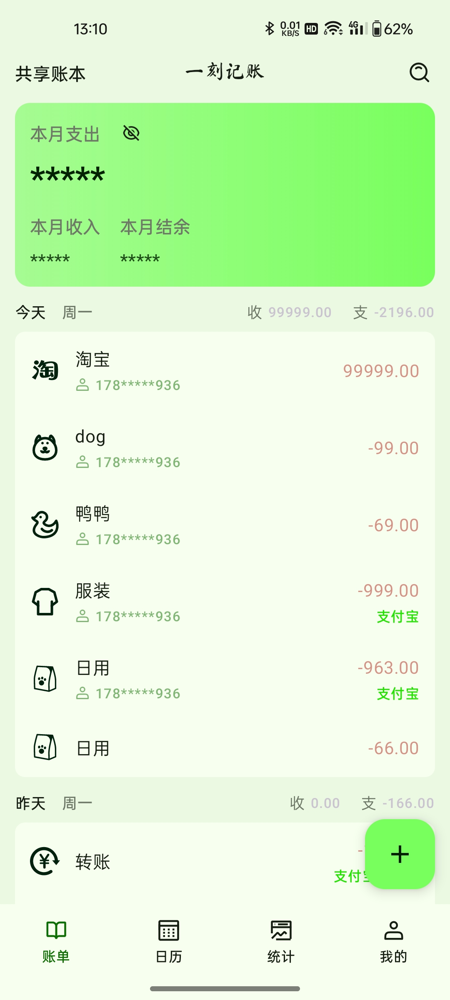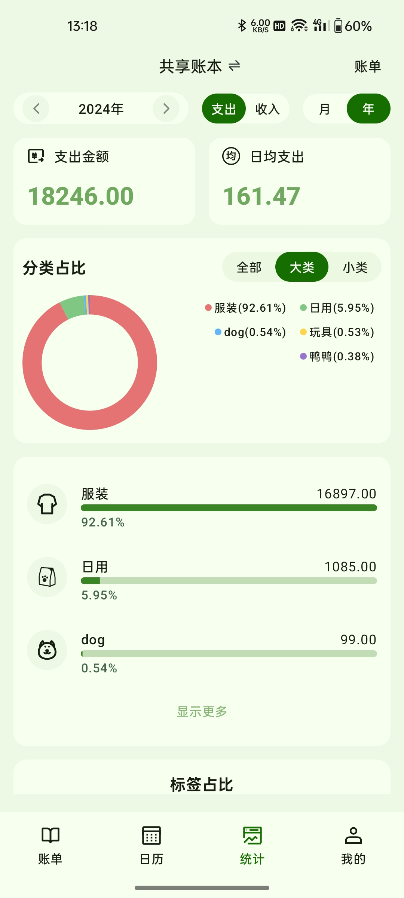

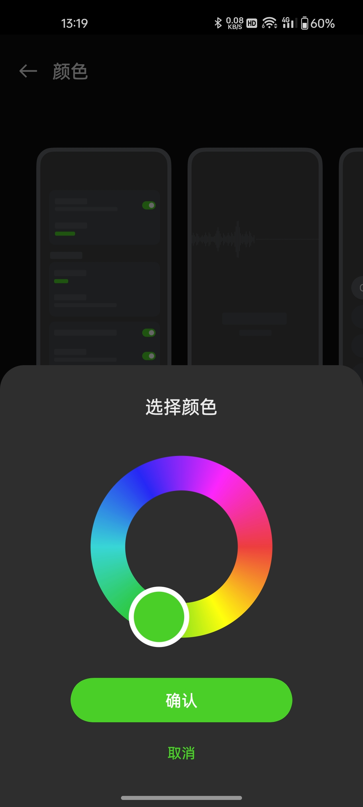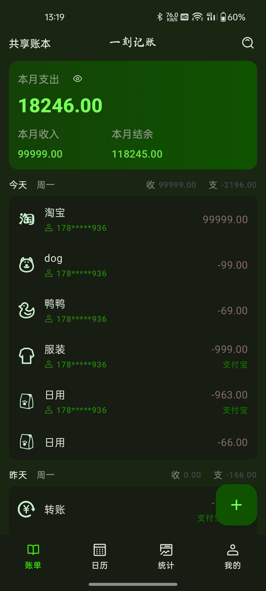

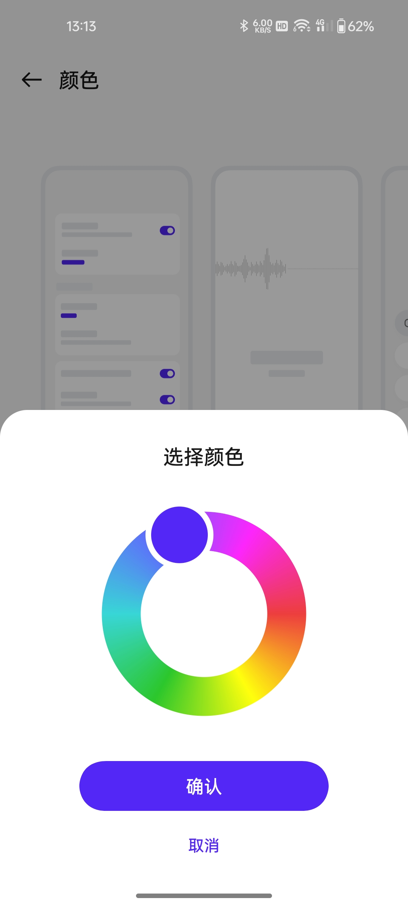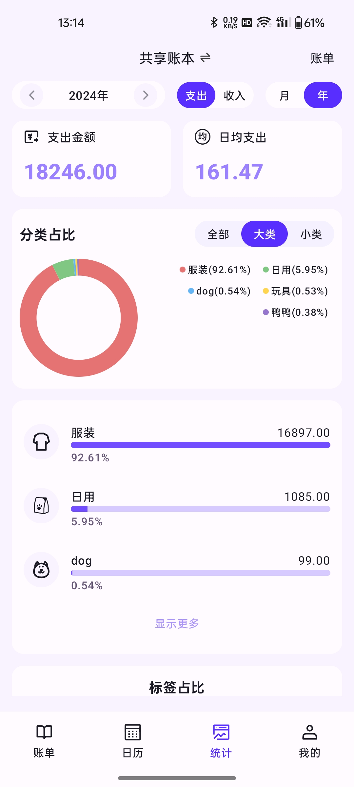

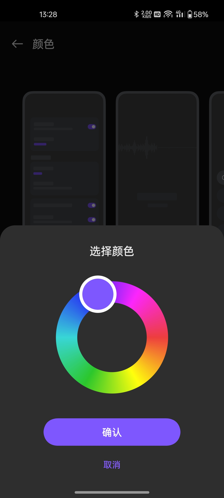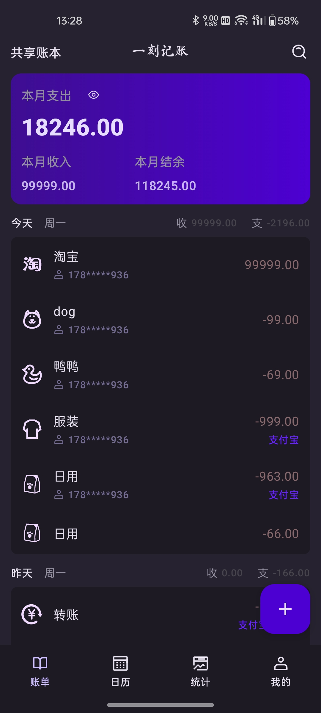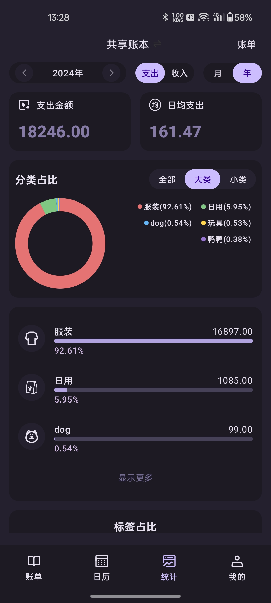

### 运行源码

---

首先找到一个存放源码的文件夹. 我的文件夹名字叫：yike-app

然后根据你依赖的方式选择其一进行源码依赖

使用 ssh 的命令

```Text
git clone git@github.com:xiaojinzi123/yike-app-common.git ./common
git clone git@github.com:xiaojinzi123/yike-app-adapter.git ./opensource
```

否则使用下面的命令

```Text
git clone https://github.com/xiaojinzi123/yike-app-adapter.git ./common
git clone https://github.com/xiaojinzi123/yike-app-adapter.git ./opensource
```

clone 完成之后文件结构如下：

```Text
yike-app
	- common
	- opensource
```

然后在 Android Studio 中打开即可 common 文件夹即可运行
