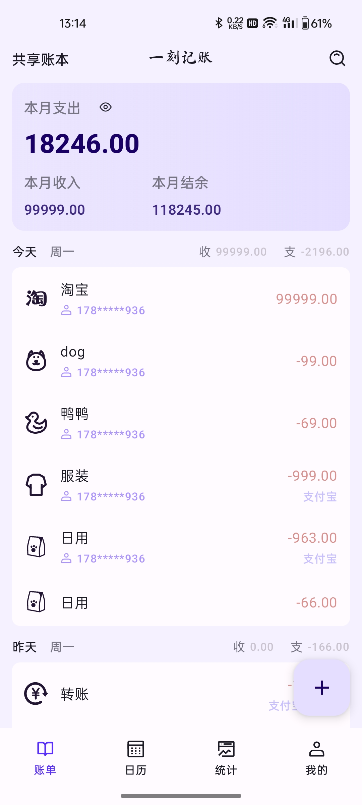

### 前言

---

一刻记账的开源版本终于来啦. 开源版本和商用版本最大的区别就是去掉了服务器相关的支持

所有和服务器相关的功能在开源版本是没有的. 但是开源版本默认会为您完成登录. 使用默认 userId

所有记账功能基本都是 ok 的. 有兴趣的点点 star 哦

开源版可以跟随下面的指导进行 clone 并运行, 商业版下载地址：https://yike.icxj.cn

### 产品示例图

---


&nbsp;&nbsp;&nbsp;&nbsp;&nbsp;&nbsp;&nbsp;&nbsp;

&nbsp;&nbsp;&nbsp;&nbsp;

&nbsp;&nbsp;&nbsp;&nbsp;

&nbsp;&nbsp;&nbsp;&nbsp;

&nbsp;&nbsp;&nbsp;&nbsp;

### 运行源码

---

首先找到一个存放源码的文件夹. 我的文件夹名字叫：yike-app

然后根据你依赖的方式选择其一进行源码依赖

使用 ssh 的命令

```Text
git clone git@github.com:xiaojinzi123/yike-app-common.git ./common
git clone git@github.com:xiaojinzi123/yike-app-adapter.git ./opensource
```

否则使用下面的命令

```Text
git clone https://github.com/xiaojinzi123/yike-app-adapter.git ./common
git clone https://github.com/xiaojinzi123/yike-app-adapter.git ./opensource
```

clone 完成之后文件结构如下：

```Text
yike-app
   - common
   - opensource
```

然后在 Android Studio 中打开即可 common 文件夹即可运行

### 项目用到的技术

- 响应式编程
- Room 数据库
- OkHttp
- Retrofit
- [MVI 业务架构](https://github.com/xiaojinzi123/AndroidReactive)
- [组件化 KComponent](https://github.com/xiaojinzi123/KComponent)
- Material Design3
- 数据同步方案 (开源版本没有)
- 多数据库方案 (一个用户对应一个数据库)
