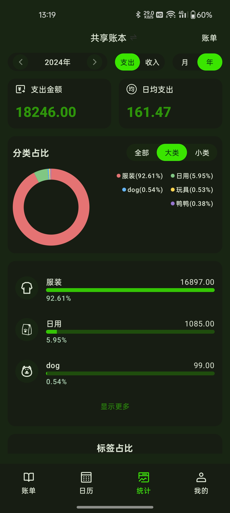

### 前言

---

一刻记账的开源版本终于来啦. 开源版本和商用版本最大的区别就是去掉了服务器相关的支持.

所有和服务器相关的功能在开源版本是没有的. 但是开源版本默认会为您使用默认 userId 完成本地登录. 

所有记账功能基本都是 ok 的. 觉得不错的点点 star 哦

开源版本呢, 最核心的目的是分享技术. (请勿进行商业活动哦!)

- 开源版本下载：[https://github.com/xiaojinzi123/yike-app/releases](https://github.com/xiaojinzi123/yike-app/releases)
- 商业版下载地址：[https://yike.icxj.cn](https://yike.icxj.cn)
- 如果你是开发者, 可以跟随下面的文档进行 clone 源码并运行

### 产品示例图

---


&nbsp;&nbsp;&nbsp;&nbsp;&nbsp;&nbsp;&nbsp;&nbsp;

&nbsp;&nbsp;&nbsp;&nbsp;

&nbsp;&nbsp;&nbsp;&nbsp;

&nbsp;&nbsp;&nbsp;&nbsp;

&nbsp;&nbsp;&nbsp;&nbsp;

### 运行源码

---

首先找到一个存放源码的文件夹. 我的文件夹名字叫：yike-app

clone 项目

```Text
git clone https://github.com/xiaojinzi123/yike-app-common.git ./common
git clone https://github.com/xiaojinzi123/yike-app-adapter.git ./opensource
```

clone 完成之后文件结构如下：

```Text
yike-app
   - common
   - opensource
```

然后在 Android Studio 中打开即可 common 文件夹即可运行

### 模块介绍

- [yike-app-adapter](https://github.com/xiaojinzi123/yike-app-adapter.git)
  - app 壳工程模块
  - module-network // 提供和服务器通信的网络实现模块 (开源版本只有一些个默认实现, 真的实现在商用版本中才有实现)
- [yike-app-common](https://github.com/xiaojinzi123/yike-app-common)
  - build-logic // gradle 脚本
  - lib-res // 存放所有的资源
  - module-base // 业务模块的 Base
  - module-core // 记账的大部分核心功能的实现模块
  - module-datasource // 提供数据支持的能力. (多用户的数据库)
  - module-image-picker // 图片选择器模块
  - module-image-preview // 图片预览模块
  - module-main // index、setting 等界面
  - module-qrcode // 二维码实现模块
  - module-user // 用户模块
  - module-widget // 系统小部件实现模块

### 项目用到的技术

- 响应式编程
- Room 数据库
- OkHttp
- Retrofit
- [MVI 业务架构](https://github.com/xiaojinzi123/AndroidReactive)
- [组件化 KComponent](https://github.com/xiaojinzi123/KComponent)
- Material Design3
- 数据同步方案 (开源版本没有)
- 多数据库方案 (一个用户对应一个数据库)

### Star History

[](https://www.star-history.com/#xiaojinzi123/yike-app&Date)
